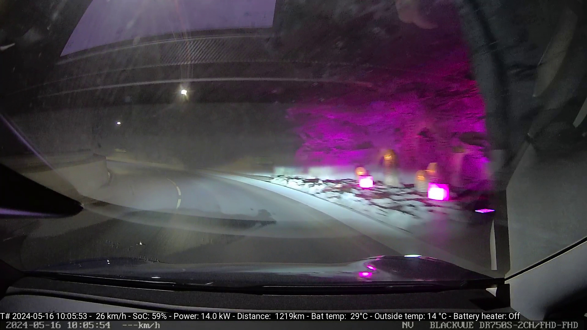
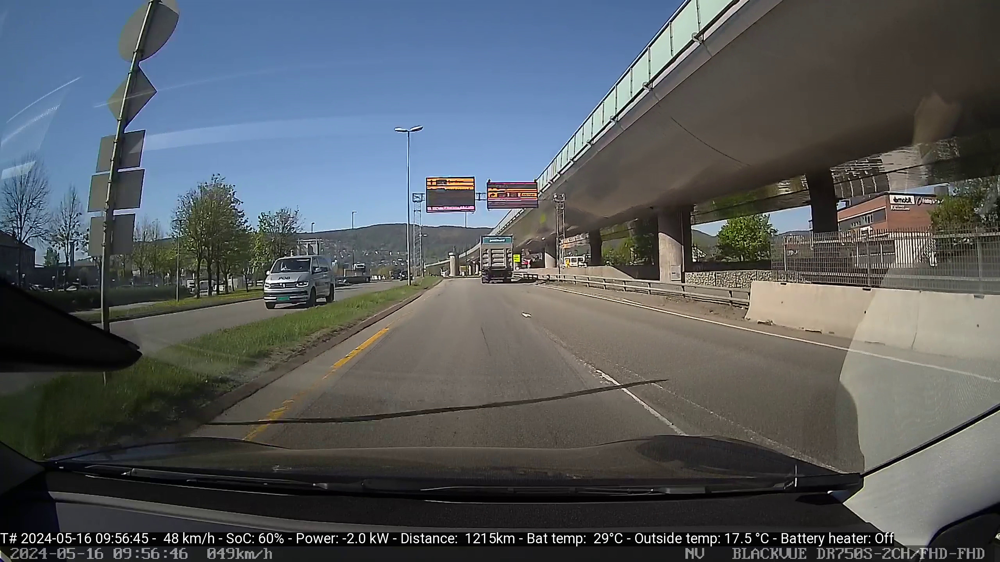
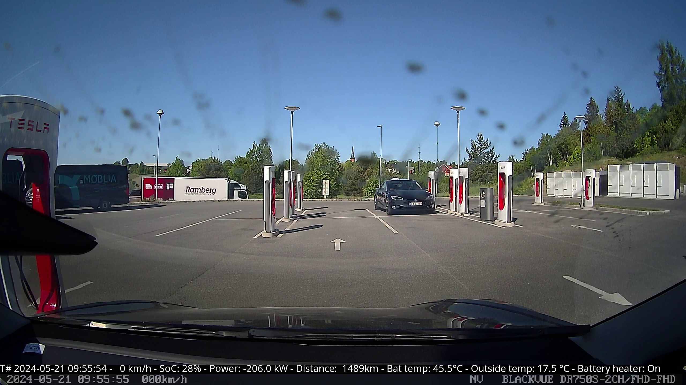
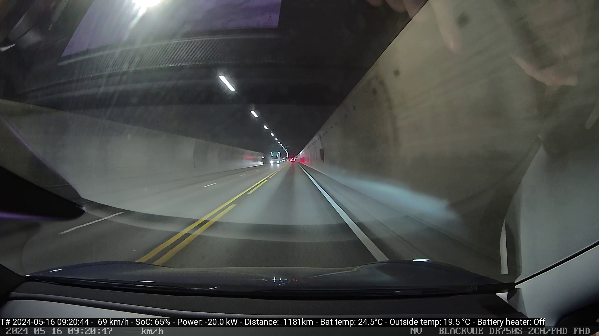

# Dashcam Teslalogger Overlay
This is a coolection of php scripts to put an simple Telemetry overlay over Dashcam videos.  
Data is synced for every frame  
I wrote this for Data comming from the Teslalogger.  
I originally didn't intended to reuse or publish this code, so there is a lot of mess in it.
Its all made for the Combinations of The Teslalogger and a BlackVue Dashcam. But with some adaption of the naming format of files and data cols, it should also work with other dashcams and other data sources.

## How to use
The script expects a csv export as data source. Teslalogger comes with grafana whichs provides such an export.
And of course you need the videos you want to overlay.
you have then some scripts which each dose one step in the process

- videoConfig.php - This is a little configuration file, edit this to your needs
- createCleanCsv.php - It takes the raw grafana exports and creates a nice CSV for further processing
- (index.php - was used to export GPS data, but I found out realing on the filenames is better, so currently unused)
- VideoTimes.php - caluclates the time for each video frame and writes it into a csv file
- VideoSoc.php - Creates a ffmpeg command list containing all the informations processed before. It also interpolates missing data (Teslalogger normaly doesn't collect 30 datapoints per second ;-) )
- make-video.php - runs ffmpeg to create the output video, that may take a while.

## Examples
| | |
|:-------------------------:|:-------------------------:|
| ||
| ||
